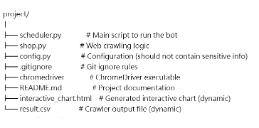

# DC_Bot
This is a Python-based Discord bot that features keyword configuration, real-time price crawling, CSV export, and interactive chart generation. Users can query product prices using simple commands, with results visualized in chart form.
# Project Structure


## Features
* Allows flexible product selection without regional restrictions.
* Some sellers list many products within detailed descriptions, so accurately extracting prices by keywords improves usability.
* Setting filters to exclude unreasonable prices enhances data quality.
* When many products are listed on the platform, the line chart can become too dense and cluttered.
* Consider better visualization methods like interactive filtering, grouping, or pagination to improve clarity and user experience.
* And more!

## Getting Started
* Add your Discord Bot Token to the config file.
* Install packages and set up:
    a. Download the ChromeDriver version that matches your installed Google Chrome browser.
    b. Run:pip install pandas plotly discord.py python-dotenv selenium webdriver-manager

Then, run the bot by running the `scheduler.py` file.
```
python scheduler.py
```

## Usage
 `!kwset Product Name` 

